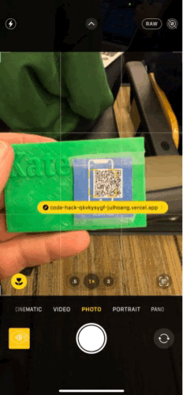

# MedMate - A system for Patients to Access and Control Their Health Records

## About the Project
This is an app developed for the #islandHealth Code Hack 2023 event. 
Within 24 hours, we developed a system facilitating all doctors and patients interactions with a central health database.
The system includes:
1. A web app (separate [repo](https://github.com/julhoang/code_hack_patient_app)) for patients to view and control their own health records.
2. A cross-platform app (currently designed for iPad) (separate [repo](https://github.com/mattrltrent/code_hack_2023_client)) for doctors to write to the health database.
3. A webpage (current repo) to show a person's public info in case of emergency. 

Please note that the simulated health database has been taken down after the event. The sample API response from the server can be found in `src/utils/sampleServerResponse.json`

 

## Developer Team
- 👩‍💻 [Julia Hoang](https://github.com/julhoang)
- 🧑‍💻 [Matthew Trent](https://github.com/mattrltrent)
- 🧑‍💻 [Christopher Huk](https://github.com/TalentedB)
  

 

## Demo
- Scan QR code to view the patient's public profile.  
- All information shown on screen can be modified in the [web app](https://github.com/julhoang/code_hack_patient_app)  
 

